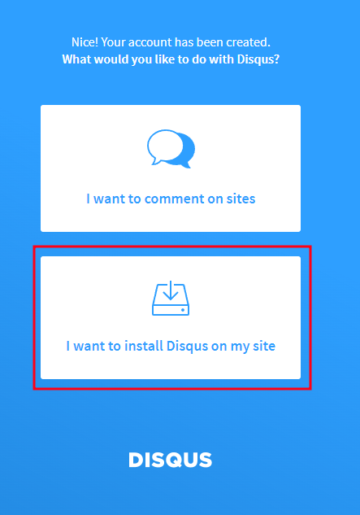
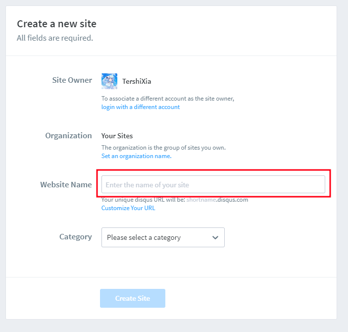
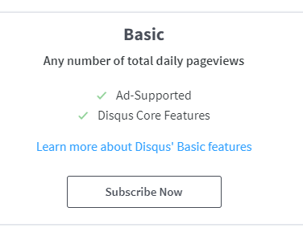
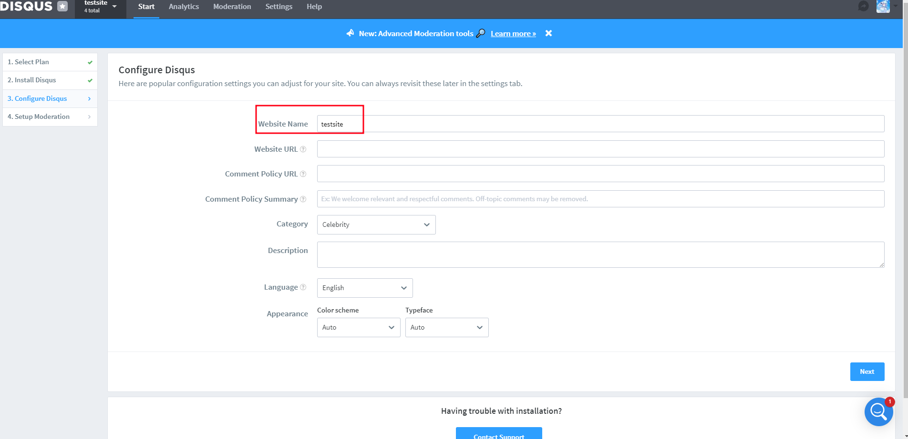
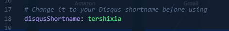
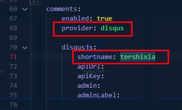
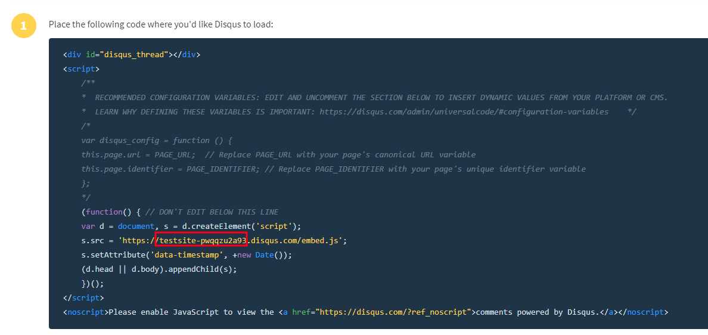
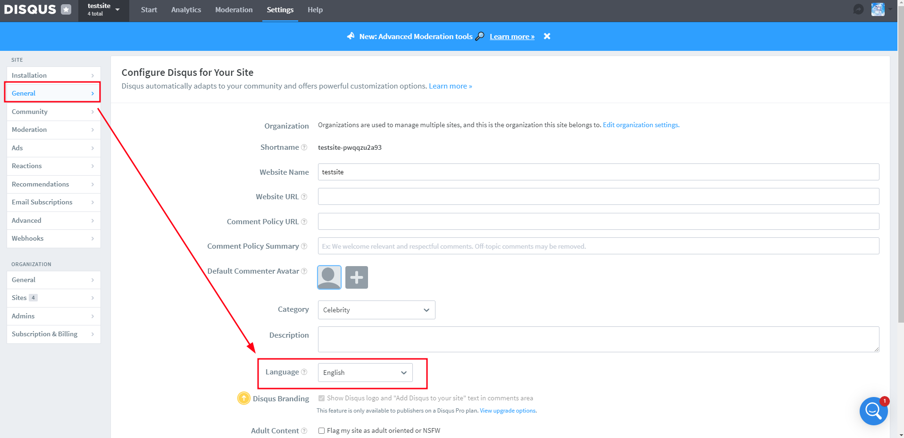
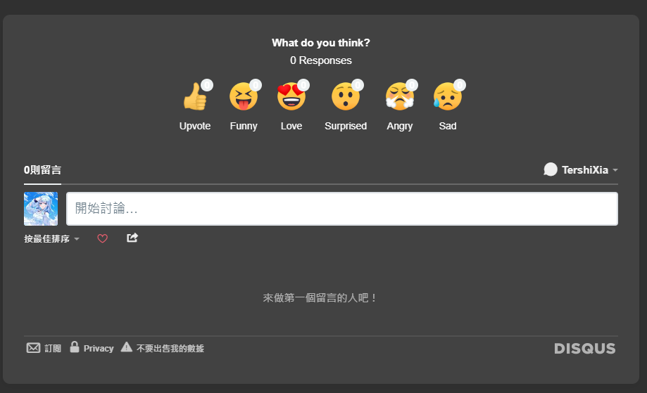

## 前言
相信大家都希望在使用 Hugo 的時候都非常痛恨沒有留言區吧，作為一個正在學習的學生，免不了跟大家作技術交流，此時沒有留言版，會顯得非常怪和痛苦。


## 註冊 Disqus 帳號
首先到 [Disqus 網站](https://disqus.com/profile/signup/intent/) 註冊一個帳號，先點擊底下的"I want to install Disqus on my site"。



然後填入 "Website Name"，此時要記住這個Name，會對應到後面的 Short Name。Category隨意選。



接著點選最基本免費功能即可，一路下去跳到第三步驟。



到了第三個步驟，請確認你的 Website Name 是否是 Short Name，這個在等等的 config.yaml設定檔案會用到。



## 設定 config 檔

### 直接設定 Hugo config.yaml
在你的 ```config.yaml``` 中的 ```disqusShortname``` 輸入你的shortName。



在你的 ```config.yaml``` 中的 ```disqusjs: shortname: ``` 中，將你的 ShortName 填入。




### (非Hugo)將 Disqus 程式碼嵌入Javascript

將第二步的程式碼貼入到你的網站，即可。請注意！紅色方框框起來的是你的ShortName，必須更改。

```Html
<div id="disqus_thread"></div>
<script>
    /**
    *  RECOMMENDED CONFIGURATION VARIABLES: EDIT AND UNCOMMENT THE SECTION BELOW TO INSERT DYNAMIC VALUES FROM YOUR PLATFORM OR CMS.
    *  LEARN WHY DEFINING THESE VARIABLES IS IMPORTANT: https://disqus.com/admin/universalcode/#configuration-variables    */
    /*
    var disqus_config = function () {
    this.page.url = PAGE_URL;  // Replace PAGE_URL with your page's canonical URL variable
    this.page.identifier = PAGE_IDENTIFIER; // Replace PAGE_IDENTIFIER with your page's unique identifier variable
    };
    */
    (function() { // DON'T EDIT BELOW THIS LINE
    var d = document, s = d.createElement('script');
    s.src = 'https://你的ShortName.disqus.com/embed.js';
    s.setAttribute('data-timestamp', +new Date());
    (d.head || d.body).appendChild(s);
    })();
</script>
<noscript>Please enable JavaScript to view the <a href="https://disqus.com/?ref_noscript">comments powered by Disqus.</a></noscript>
```




## 將留言區更改為正體中文

進入到[後台](https://disqus.com/)，右上角的Admin，找到```General```，找到Language，並更改為Chinese(Taiwan)，即有中文出現。



## 成果

此時會在你的網站或是部落格底下出現你的留言區，如果出現留言區代表你設定成功，現在的 Disqus 仍然是中英文夾雜的，有待官方翻譯完成。



## 結尾
Disqus 在各大網站上都會看到，是一個很好用的聊天室工具，其提供了強大的功能，可以讓使用者在裡面交流、發問。
在靜態網頁中加入留言區是個不錯的選擇，對於讀者有問題發問時，就會有留言區可以發問。
如果有任何問題也可以在底下發問喔，如果我有看到的話，或是通過我的聯絡方式聯絡我也是可以，我的聯絡方式都會在我的網站上。希望這篇教學會幫助大家。