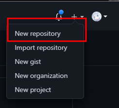
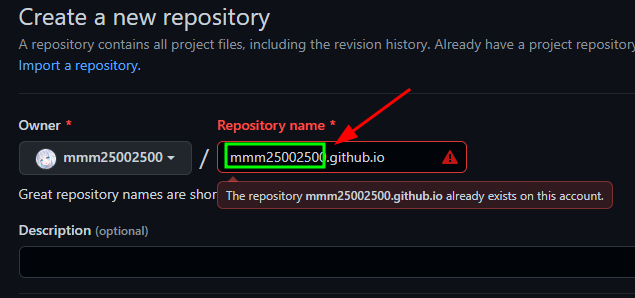
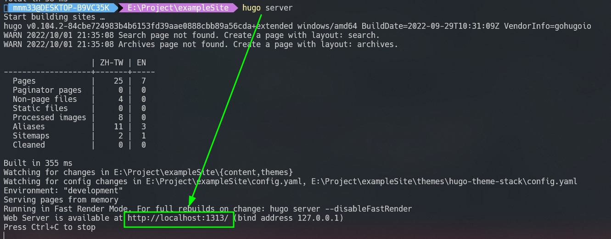
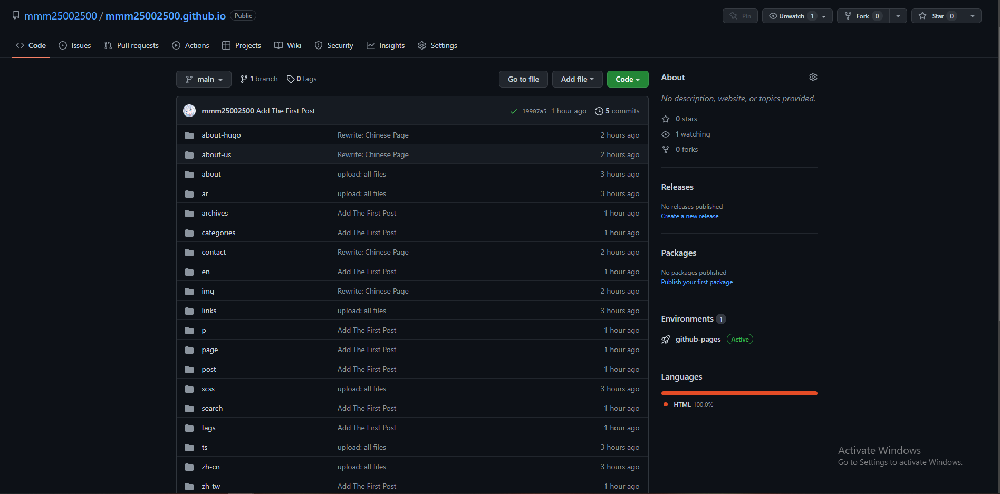
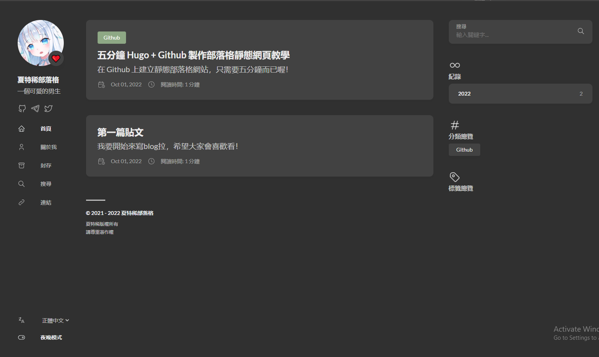
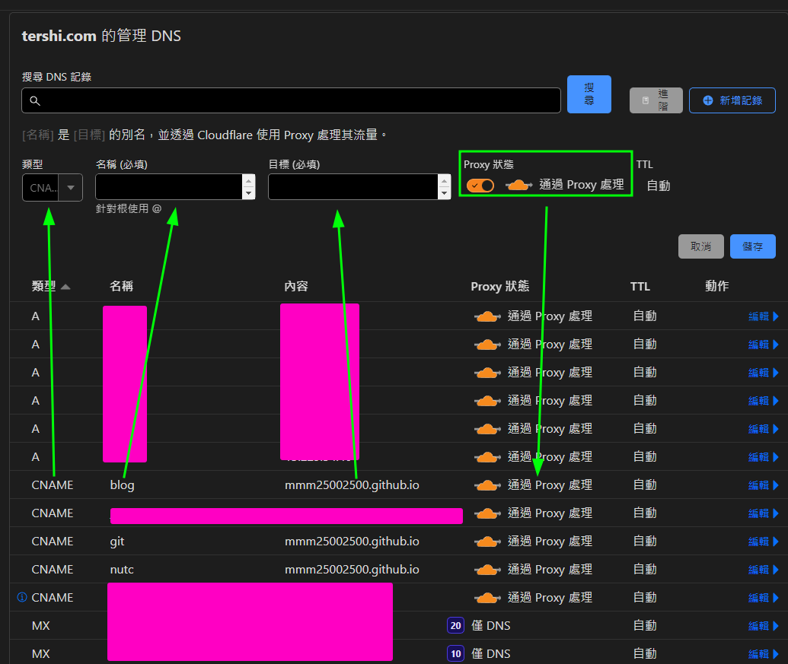
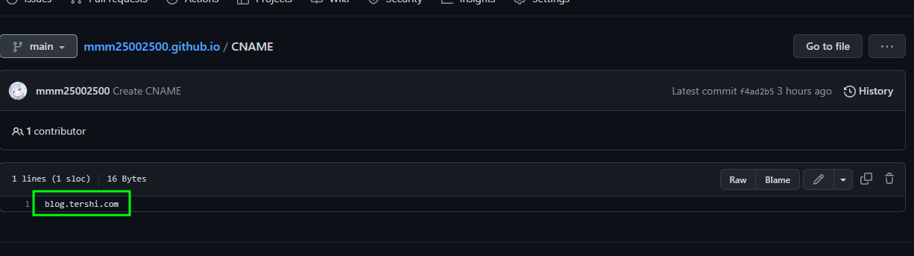

## 前言
相信有在使用 Github 的朋友們，應該知道 Github Page，通過這個東西，我們可以在上面運行我們的靜態網頁，做出自己想要的個人網站或是部落格，但因為是靜態網頁，所以不支援所有動態操作，例如：登入、PHP處理...。因此在本篇，我將為大家介紹 Hugo 這酷東西。

## 安裝

### Windows
**Step 1.** 如果你是 Windows 使用者，請去 [Hugo Repo](https://github.com/gohugoio/hugo/releases) 下載 Windows 版本的Hugo，並且解壓至 ```C:\\hugo\bin```。

**Step 2.** 請到 設定/環境變數 中，選擇「系統」，接下來到選擇「Path」，並將```C:\\hugo\bin```輸入進去。

**Step 3.** 打開你的 命令提示字元(cmd) 輸入 ```hugo --version```，並且有出現版本訊息，代表安裝成功。

### Linux
根據你的發行版而定，本篇以Ubuntu作為教學。

**Step 1.** 請輸入 ```sudo apt update && sudo apt install hugo```(此時的 ```hugo```要因你的套件名而定)

**Step 2.** 請輸入 ```hugo --version```，並且有出現版本訊息，代表安裝成功。

### MacOS
**Step 1.** 請打開你的終端機

**Step 2.** 請輸入 ```brew install hugo```

**Step 3.** 請輸入 ```hugo --version```，並且有出現版本訊息，代表安裝成功。

## 建立 Github Page Repository
**Step 1.** 首先到你的 Github 主頁，並且在右上角找到「+」，點選「New Repository」



**Step 2.** Repository Name 填寫「使用者名稱.github.io」



## 匯入主題
**Step 1.** 先進入此[網頁](https://themes.gohugo.io/)，並選擇你喜歡的主題，按下Download進行下載。

**Step 2.** 將下載好的(以hugo-theme-stack.rar為例)壓縮檔解壓下來，將 exampleSite 移動至桌面。

**Step 3.** 在 exampleSite 建立一個資料夾為「themes」，並且將剛解壓好的檔案全部丟入裡面。

## 開始設定
**Step 1.** 打開你的終端機，進去 exampleSite。

**Step 2.** 輸入 ```hugo server```，此時會建立一個內網網站，將網址放入網頁瀏覽器中，即可以看到畫面。



**Step 3.** 通過 vscode或是其他檔案編輯器編輯```config.ymal```。

## 回推上傳至 Github
**Step 1.** 編輯好後，在終端機輸入 ```hugo```，此時會建立所需要的檔案至 ```public/```。

**Step 2.** 將剛剛建立好的 Repository Clone下來: ```git clone https://github.com/使用者名稱/使用者名稱.github.io```，此時 git 會建立一個資料夾。

**Step 3.** 將 ```public/```裡面所有資料夾和檔案複製到 Clone下來的 ```使用者名稱.github.io```資料夾。

**Step 4.** 輸入 ```git add . && git commit -m "第一次上傳" && git push```

## 網頁上線
此時 Github Action會自動啟動，將你的Github Page 自動上線，網址會是: ```https://使用者名稱.github.io```





## 綁定網域
### 網域設定 
在你的網域提供商，建立一個CNAME紀錄，指向```使用者名稱.github.io```



以CloudFlare為例，將類型設定為 CNAME，名稱為你需要的網域子域名，目標為Github Page 網址，開不開Proxy其實沒差，IP是Github，不會被駭客發現其他IP。

### 設定 Github Page Domain

在 Github Repo 建立一個新的檔案叫做```CNAME```，並將你的網域放入裡面



## 結尾
希望大家看到這裡，透過手把手一步步教學，可以建立出一個 Hugo 靜態網頁。通過 Github Page，可以建立一個個人網頁或是部落格，Github Page的應用很廣，今天我只在 Hugo 講解。因為我也想要來寫寫看部落格，就順手搭建了 Hugo，建立Hugo網頁並沒有想像中的這麼難，反而五分鐘以內就可以搭建完成，剩下的都只是設定和文章內容撰寫而已。如果有任何問題可以來信問我，或是通過我的通訊軟體聯絡我，也可以在下方留言詢問喔，前提是我要看到。

<!-- > 思念是最暖的憂傷像一雙翅膀  
> 讓我停不了飛不遠在過往遊蕩  
> 不告而別的你 就算為了我著想  
> 這麼沉痛的呵護 我怎麼能翱翔
> 
> *[最暖的憂傷 - 田馥甄](https://www.youtube.com/watch?v=3aypp_YlBzI)* -->