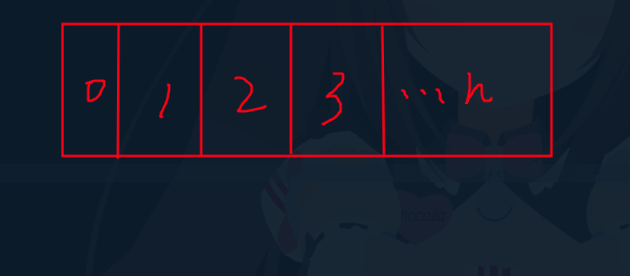

## 前言
大家常常在存放多筆資料的時候，會使用到一個資料型態叫做「陣列」，針對不同的語言有相似的資料型態，以Python來說，只有串列，但其他大部分語言都是有Array，本篇將細分介紹陣列及串列，以及將串列拆分三種來比較，方便大家理解，我會使用 Java 語法來介紹。

## Array(陣列)
當我們要儲存多筆資料的時候，常常會使用到陣列，陣列有一個很重要的特性，跟串列不同的是，陣列是需要先定義資料大小的，也是採用固定空間分配的概念來存放陣列。

如下圖，陣列需要先定義好一個大小 n，由於索引值也會跟著定好，因此在尋找的時候就會比較快速。但是如果要插入一個新的元素，就會整個陣列都影響，執行效率會較久。



### 建立陣列
建立陣列非常簡單，new為建立一個新的 Array 物件。
```java
// 建立大小為 20 的陣列
int[] arr = new int[20];
int[] arr2 = new int[20];
```
### 使用陣列
```java
// 設定 arr 第 0 位置為 50
arr[0] = 50;
// 設定 arr 第 1 位置為 20
arr[1] = 20;

// 會報錯，原因是 java在一開始宣告陣列的時候
// 型別就是 int，因此無法使用 String。
arr[1] = "Hi";

// 會輸出 50
System.out.print(arr[0]);

// 將第 1 個位置和 第0個位置加起來，傳入第二位置
arr[2] = arr[1] + arr[0]

// 後項 + 此項 = 下一項
for (int i = 2; i< arr.length; i++)
    arr[i] = arr[i-1] + arr[i-2];
```

### 多維陣列
多維陣列的觀念也非常簡單，也就是陣列中的陣列。
```java
// 建立一個十項一維及十項二維的陣列
// 此時空間大小維 10*10 = 100
int[][] arr3 = new int[10][10];
arr3[2][3] = 10;

// 會印出 10
System.out.print(arr3[2][3]);
```

## List Class


### List (串列)


### ArrayList
ArrayList 可以分配動態空間大小，也有提供許多方法可以使用，也可以建立二維 ArrayList。

#### 建立陣列
```java
// 需要先將 ArrayList 類別匯入進來
import java.util.ArrayList;

// 建立多個不同型別的陣列
ArrayList<Integer> arr1 = new ArrayList<Integer>();
ArrayList<Double> arr2 = new ArrayList<Double>();
ArrayList<Float> arr3 = new ArrayList<Float>();
ArrayList<String> arr4 = new ArrayList<String>();
ArrayList<Boolean> arr5 = new ArrayList<Boolean>();
// ArrayList<Class> arr1 = new ArrayList();
ArrayList arr6 = new ArrayList();
```

#### 使用陣列


#### 多維陣列

### LinkedList (鏈結串列)


### 三種串列比較


## 陣列、串列比較

<!-- > 思念是最暖的憂傷像一雙翅膀  
> 讓我停不了飛不遠在過往遊蕩  
> 不告而別的你 就算為了我著想  
> 這麼沉痛的呵護 我怎麼能翱翔
> 
> *[最暖的憂傷 - 田馥甄](https://www.youtube.com/watch?v=3aypp_YlBzI)* -->